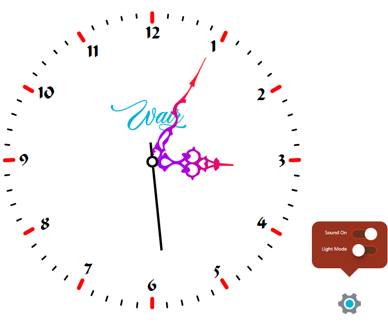

# 🕰️ Analog Clock Web App

A beautifully designed, interactive analog clock web application featuring a sleek analog clock crafted with Adobe Illustrator, customizable themes, and sound effects. Perfect for adding elegance to your browser.

## **[Live Demo](https://waiz3ple.github.io/wall-clock)**  


---

## ✨ Features

- **Analog Clock**: Smooth, real-time hour, minute, and second hands.
- **Customizable Themes**: Switch between light and dark modes.
- **Sound Effects**: Toggle ticking sounds for an immersive experience.
- **Responsive Design**: Works seamlessly on all screen sizes.
- **Tooltip Settings**: Intuitive tooltip for toggling themes and sounds.
- **Modular CSS**: Organized styles for better maintainability.

---

## 🚀 Getting Started

### Prerequisites
- A modern web browser (Chrome, Firefox, Edge, Brave).
- Node.js (optional, for local development).

### Installation
1. Clone the repository:
   ```bash
   git clone https://github.com/waiz3ple/wall-clock.git
   ```
2. Navigate to the project directory:
   ```bash
   cd wall-clock
   ```
3. Install dependencies (if applicable):
   ```bash
   npm install
   ```
4. Run locally in your browser:
   ```bash
   npm run dev
   ```

---

## 🛠️ Usage

- **Toggle Theme**: Click the settings icon (⚙️) to switch between light and dark modes.
- **Enable/Disable Sound**: Use the sound toggle in the tooltip.
- **Close Tooltip**: Click outside the tooltip or the close button to dismiss it.

---

## 🎨 Customization

### Themes
Modify `variables.css` to customize light and dark modes.

### Sounds
Replace `clock-ticking.wav` in the `assets/sounds` folder with your preferred audio file.

### Modular CSS
Styles are split into:
- `fonts.css`: Custom fonts.
- `variables.css`: Theme and color variables.
- `base.css`: Global styles.
- `clock.css`: Clock-specific styles.
- `checkbox.css`: Toggle switch styles.
- `tooltip.css`: Tooltip styles.
- `media-queries.css`: Responsive adjustments.
- `animations.css`: Keyframe animations.
- `settings-icon.css`: Settings icon styles.

---

## 🌐 Browser Support

Tested on:
- Google Chrome
- Mozilla Firefox
- Microsoft Edge
- Brave

---

## 🛠️ CI/CD for GitHub Pages

Automatically deploys to GitHub Pages only when the `main` branch is built. The `dist` folder is generated and deployed.
---

## 🤝 Contributing

1. Fork the repository.
2. Create a new branch (`git checkout -b feature/YourFeature`).
3. Commit your changes (`git commit -m 'Add some feature'`).
4. Push to the branch (`git push origin feature/YourFeature`).
5. Open a pull request.

---

## 📜 License

Licensed under the [MIT License](LICENSE).  
**Please do not claim this project as your own.**

---

## 👤 Author

- **Wasiu Ramoni**
- GitHub: [@waiz3ple](https://github.com/waiz3ple)
- Twitter: [@waiz3ple](https://x.com/waiz3ple)
- Telegram: [t.me/waiz3ple](https://t.me/waiz3ple)

---

Enjoy your time with the Analog Clock App! ⏰